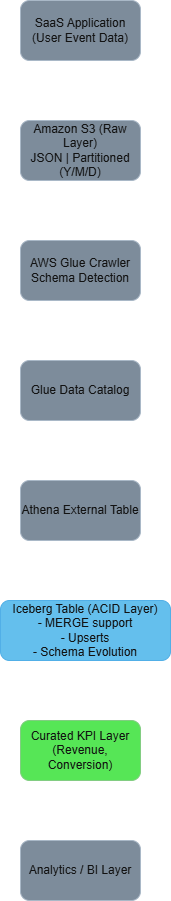

# saas-lakehouse-aws
Production-ready SaaS Lakehouse Architecture using AWS, Iceberg, and Athena.
# 🚀 SaaS Lakehouse Architecture on AWS

## 📌 Overview

This project demonstrates a production-ready SaaS analytics lakehouse built on AWS using Apache Iceberg and Athena.

The architecture supports:

- ACID transactions
- Incremental upserts (MERGE INTO)
- Partition pruning
- Parquet optimization
- Business KPI generation
- Cost-efficient serverless analytics

---

## 🏗 Architecture Diagram


---

## 🛠 Tech Stack

- Amazon S3 – Data Lake Storage
- AWS Glue – Schema Discovery & Data Catalog
- Amazon Athena (Engine v3) – Serverless SQL
- Apache Iceberg – ACID Table Format
- Parquet – Columnar Storage Optimization

---

## 📂 Data Architecture

### 1️⃣ Raw Layer
Partitioned JSON storage:

s3://bucket/raw/events/year=YYYY/month=MM/day=DD/

- Immutable source-of-truth
- Optimized for ingestion

---

### 2️⃣ Iceberg Lakehouse Layer

Created Iceberg table with:

- ACID compliance
- MERGE INTO support
- Snapshot isolation
- Schema evolution capability

This enables incremental processing instead of full table rebuild.

---

### 3️⃣ Curated Business Layer

Aggregated KPI table provides:

- Total events
- Total purchases
- Conversion rate
- Estimated revenue by subscription plan

---

## 🔄 Incremental Processing Strategy

Instead of rebuilding tables:

- New partitions detected via Glue
- Data merged using MERGE INTO
- Curated layer updated incrementally
- Reduced query cost using partition filters

---

## 💰 Cost Optimization Strategy

- Partitioned storage (year/month/day)
- Columnar Parquet format
- Athena serverless execution
- No cluster management overhead
- Partition pruning reduces scan volume

---

## 📊 Sample Business Query

Plan-wise conversion rate:

```sql
SELECT 
    plan,
    COUNT(*) AS total_events,
    COUNT(CASE WHEN event='purchase' THEN 1 END) AS purchases,
    COUNT(CASE WHEN event='purchase' THEN 1 END) * 100.0 / COUNT(*) AS conversion_rate
FROM events_iceberg
GROUP BY plan;
```
## 🧠 Senior-Level Design Decisions

- Used Iceberg instead of basic external tables for ACID guarantees
- Implemented MERGE INTO for upsert capability
- Designed medallion architecture (Raw → Lakehouse → Curated)
- Applied partition pruning for performance optimization
- Separated raw and business logic layers

## 🔮 Future Enhancements

- Glue ETL automation
- CI/CD deployment
- Data quality framework integration
- Real-time ingestion via streaming services
- Dashboard integration (QuickSight / BI tools)

## 👨‍💻 Author

**Gaurav**  
Data Engineer | AWS Lakehouse | Iceberg  
📫 datacode.gaurav@gmail.com
- LinkedIn - https://www.linkedin.com/in/gaurav-dataengineer/
